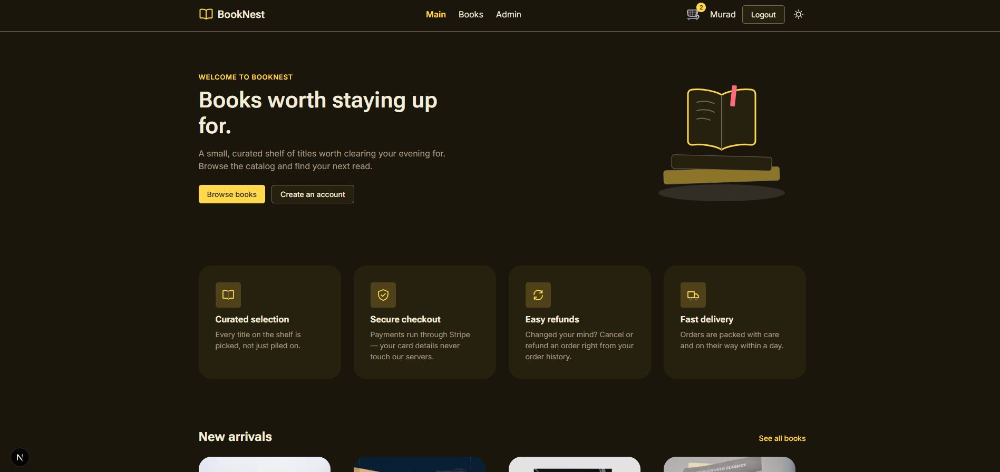
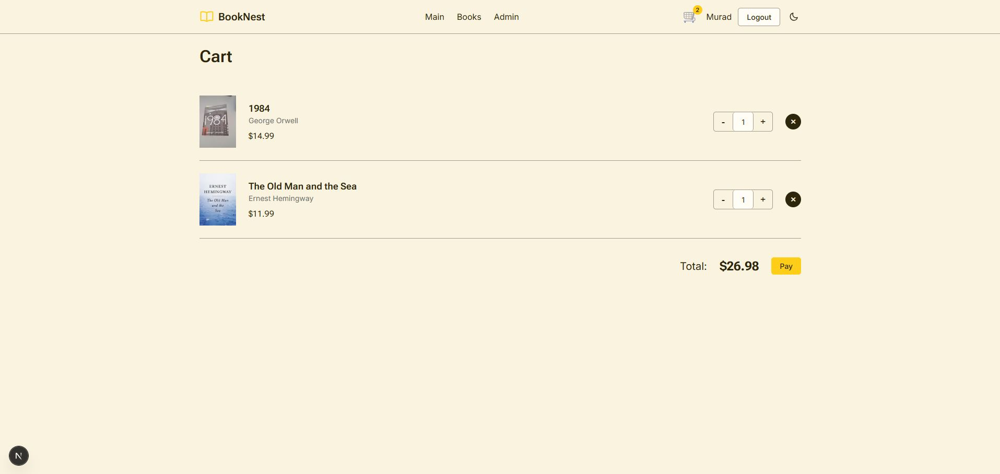
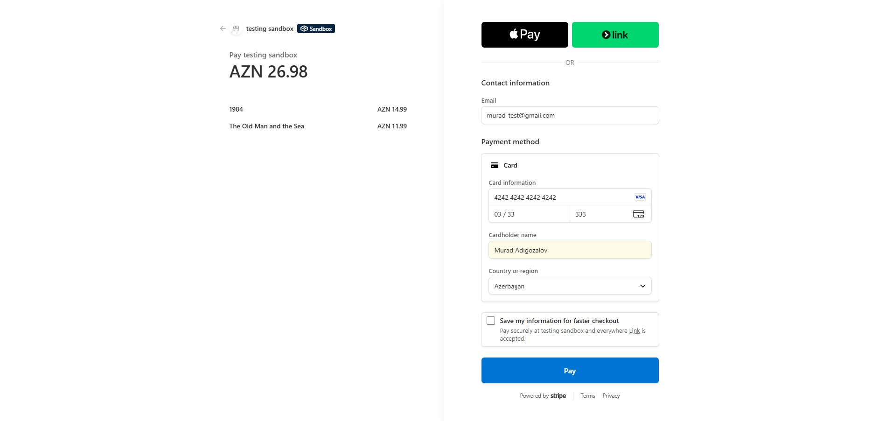
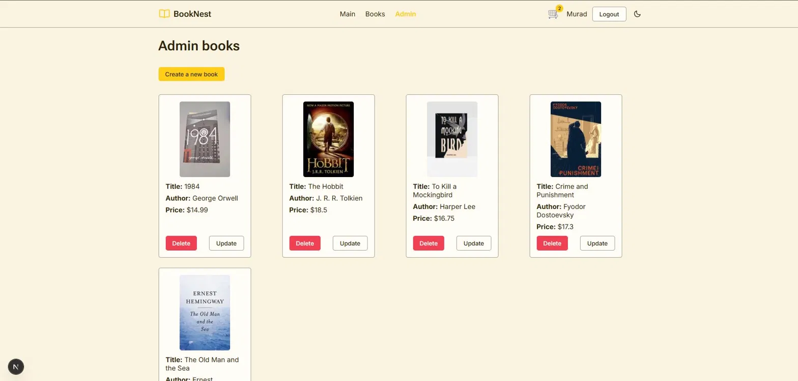
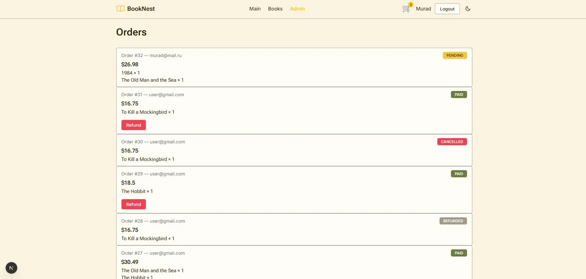

# BookNest

Книжный интернет-магазин с полноценным циклом покупки — от каталога до оплаты — сделанный в production-like стиле как pet-проект для отработки fullstack-разработки на реальном денежном флоу (Stripe), а не на упрощённой демо-логике.

## Демо

🔗 **Live:** https://murad-booknest.vercel.app

| | |
|---|---|
| Тестовый пользователь | `user@gmail.com` / `123456` |
| Успешная оплата | `4242 4242 4242 4242` |
| Отказ карты | `4000 0000 0000 0002` |

Срок карты — любой будущий, CVC — любой. Stripe работает в тестовом режиме, реальные деньги не списываются. Админ-панель на проде не открыта публично — управление книгами, пользователями и refund доступны только с ролью admin, доступ к тестовому admin-аккаунту предоставляется по запросу. Как выглядит админка — см. раздел «Скриншоты» ниже.

## Стек

- **Frontend:** Next.js (App Router), React, TypeScript, TanStack Query, React Hook Form, Zod
- **Backend:** Next.js API routes и Server Actions, PostgreSQL, Prisma ORM
- **Auth:** Auth.js (JWT-based аутентификация, роли user/admin)
- **Платежи:** Stripe (Checkout, webhooks, идемпотентность, retry, refund)
- **UI:** Tailwind CSS, кастомная библиотека компонентов (Button, Card, Badge и др.), Radix UI-примитивы (select, checkbox, dialog, radio-group), светлая/тёмная тема
- **Инфраструктура:** Supabase (PostgreSQL + Storage); полноценный CI/CD — CI на GitHub Actions (install → lint → build → test на каждый push/PR в main), CD — автодеплой на Vercel по push в `main` через встроенную интеграцию с GitHub. Production-релиз защищён Vercel Deployment Checks: пока job `test` не позеленеет, билд не промоутится на продовый домен — деплой с падающими тестами не долетает до пользователей
- **Тесты:** Vitest, React Testing Library

## Возможности

- Каталог книг с фильтрацией и поиском
- Корзина и оформление заказа
- Оплата через Stripe Checkout с полным webhook-флоу (успех, отказ карты, истечение сессии)
- Повторная оплата (retry) для неуспешных заказов
- Возврат средств (refund) — инициируется админом, источник истины — Stripe webhook, а не прямое изменение БД
- Идемпотентная обработка webhook-событий (защита от дублей)
- Защита от race conditions при параллельных/повторных webhook-событиях
- Админ-панель: управление книгами, пользователями, заказами
- Разграничение доступа по ролям (user/admin) на уровне middleware
- Юнит- и компонентные тесты ключевых частей приложения

## Скриншоты

### Витрина

Главная страница — светлая и тёмная тема:

<p align="center">
  
  
</p>

Каталог с поиском и фильтрами по автору/цене:


### Оформление заказа

Корзина:



Оплата через Stripe Checkout:



Успешная оплата:


### Админ-панель

Главная страница админки:


Управление книгами:



Управление заказами — статусы PENDING / PAID / CANCELLED / REFUNDED, возврат средств прямо из списка:



## Запуск локально

```bash
git clone https://github.com/murad-proger/booknest.git
cd booknest
npm install
```

Создать `.env` со следующими переменными:

```
DATABASE_URL=
AUTH_SECRET=
STRIPE_SECRET_KEY=
STRIPE_WEBHOOK_SECRET=
NEXT_PUBLIC_APP_URL=
NEXT_PUBLIC_SUPABASE_URL=
NEXT_PUBLIC_SUPABASE_ANON_KEY=
SUPABASE_SERVICE_ROLE_KEY=
```

Проект использует Supabase для базы данных и для хранения обложек книг — понадобится Storage-бакет `book-covers` (public) в вашем Supabase-проекте.

Применить миграции Prisma:

```bash
npx prisma migrate dev
```

Запустить dev-сервер:

```bash
npm run dev
```

Открыть [http://localhost:3000](http://localhost:3000).

## Тестирование

```bash
npm run test
```

## Stripe: локальный webhook

Для проверки оплаты локально нужен `stripe listen`, который форвардит события с аккаунта Stripe на `/api/stripe/webhook`.

⚠️ У аккаунта проекта включён **Stripe Sandbox** ("testing sandbox"), а не classic Test Mode. Обычный `stripe login` может залогинить CLI в другой аккаунт/сэндбокс — тогда события создаются у Stripe, но до локального листенера не доходят (платёж при этом "проходит", а статус в БД не обновляется).

Поэтому **всегда** запускайте `listen` с явным `--api-key`, используя значение `STRIPE_SECRET_KEY` из `.env`:

```bash
stripe listen --api-key <STRIPE_SECRET_KEY из .env> --forward-to localhost:3000/api/stripe/webhook
```

После запуска команда напечатает `Your webhook signing secret is whsec_...` — вставьте это значение в `STRIPE_WEBHOOK_SECRET` в `.env` и перезапустите `npm run dev`.

Тестовая карта: `4242 4242 4242 4242`, любой будущий срок, любой CVC.

Тестовая карта для проверки отказа (decline): `4000 0000 0000 0002`, любой будущий срок, любой CVC. Эмулирует `payment_intent.payment_failed` — используется для проверки failed payment flow (Payment → FAILED, Order остаётся PENDING).

### Проверка истечения сессии (checkout.session.expired)

Ждать реальные 24 часа непрактично, а `expires_at` нельзя выставить меньше 30 минут через `sessions.create`. Вместо этого сессию можно принудительно "истечь" через Stripe API — это вызовет настоящее событие `checkout.session.expired` в локальном webhook:

```powershell
curl.exe -u <STRIPE_SECRET_KEY>: https://api.stripe.com/v1/checkout/sessions/cs_test_XXXXXXXX/expire -X POST
```

Замените `cs_test_XXXXXXXX` на `session.id` неоплаченной сессии (лог `createCheckoutSession()`), `<STRIPE_SECRET_KEY>` — на значение из `.env` с двоеточием в конце (Basic Auth без пароля).

⚠️ В PowerShell используйте `curl.exe`, а не `curl` — обычный `curl` в PowerShell — это алиас `Invoke-WebRequest` с другим набором параметров (`-u` там неоднозначен).

Ожидаемый результат: `Order → CANCELLED`, `Payment → FAILED` (если был `PENDING`; уже `FAILED` не трогается).

### Payment retry (повторная попытка оплаты)

`POST /api/orders/[orderId]/retry` позволяет повторить оплату для Order, который ещё в статусе `PENDING` (например, после card decline).

Логика (`createRetryCheckoutSession` в `src/services/checkout.ts`):

- если у Order уже есть `PENDING` Payment с активной (`open`) Checkout Session — возвращается **та же** `session.url`, новый Payment не создаётся;
- если у `PENDING` Payment сессия оказалась не `open` (`expired`/`complete`) — этот Payment переводится в `FAILED`, после чего создаётся новый `Payment` и новая Checkout Session;
- если Order не в статусе `PENDING` — `409 Order is not retryable`.

⚠️ На практике вторая ветка (перевод "протухшего" Payment в `FAILED`) почти никогда не срабатывает: обычно webhook `checkout.session.expired` успевает перевести весь Order в `CANCELLED` раньше, чем пользователь вызовет retry, и retry блокируется на проверке статуса Order (`409`). Ветка остаётся в коде ради редкого race condition — запрос на retry делает `stripe.checkout.sessions.retrieve()` напрямую к Stripe и может увидеть `expired` раньше, чем локальный webhook успеет обработать событие `checkout.session.expired`.

Проверено вручную через `stripe checkout sessions expire <session_id> --api-key <STRIPE_SECRET_KEY>` (Stripe CLI) — после expire webhook переводит Order → CANCELLED, Payment → FAILED, и повторный retry на этом Order корректно возвращает `409`.

### Refund (возврат оплаты)

`POST /api/orders/[orderId]/refund` — admin-only endpoint (проверка через `requireAdmin()` из `src/lib/auth-utils.ts`), инициирует возврат уже успешно оплаченного заказа.

Логика (`refundPayment` в `src/services/checkout.ts`):

- находит у Order платёж со статусом `SUCCEEDED`;
- вызывает `stripe.refunds.create({ payment_intent: payment.providerPaymentId })`;
- **не изменяет БД напрямую** — как и с оплатой, источником истины остаётся Stripe webhook.

Webhook обрабатывает событие **`charge.refunded`** (а не `refund.updated`/`refund.created`): для обычных синхронных card-рефандов именно `charge.refunded` — надёжный триггер, тогда как `refund.updated` предназначен в первую очередь для асинхронных возвратов (например, банковские переводы). `charge.refunded` возвращает объект `Charge`, из которого берётся `payment_intent` — по нему находится локальный `Payment` (`providerPaymentId`), который вместе с `Order` переводится в `REFUNDED`.

⚠️ На один вызов `stripe.refunds.create()` Stripe в реальности присылает **несколько** событий: `refund.created`, `charge.refunded`, `refund.updated`, `charge.refund.updated`. Обрабатывается только `charge.refunded` — остальные три логируются как unhandled и не вызывают побочных эффектов благодаря существующей `WebhookEvent` idempotency (каждое имеет свой уникальный `eventId`, но веток бизнес-логики для них нет).

Проверено вручную: `POST /api/orders/[orderId]/refund` на оплаченном заказе → `200 { refundId, status: "succeeded" }` → в логах `stripe listen` видно все четыре события → после обработки `charge.refunded` в БД `Order.status = REFUNDED` и `Payment.status = REFUNDED`.